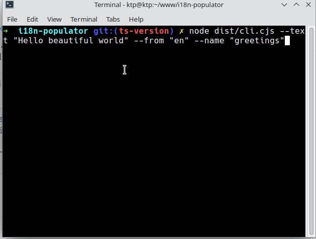

# i18n Populator

[](https://npmjs.org/package/i18n-populator)

[](https://github.com/jestjs/jest)
[](https://typescriptlang.org)

Run one command and generate all the translations for your localization JSON files using LibreTranslate, Google Translate or Bing Translate.



> [!IMPORTANT]
> DISCLAIMER! This project uses [Google Translate API](https://github.com/vitalets/google-translate-api) and [Bing Translate API](https://github.com/plainheart/bing-translate-api) libraries which aren't associated with Google and Bing and uses the web API of their web translation pages. This mean that Google and Bing translations without API Key could not work 100% of the time as these APIs are not intended for use and can change anytime, if you want a more stable result it is highly recommended to use the official Google and Bing APIs or use a free service as [Libre Translate](https://github.com/LibreTranslate/LibreTranslate) and only use the Google and Bing free options if you're working on a personal/non-commercial project.

- [i18n Populator](#i18n-populator)
  - [Cases of use](#cases-of-use)
  - [Misuse cases](#misuse-cases)
  - [Get Started](#get-started)
    - [Installation options](#installation-options)
      - [Install it as development dependency](#install-it-as-development-dependency)
        - [How to install?](#how-to-install)
        - [Creating script in package.json for translations](#creating-script-in-packagejson-for-translations)
      - [Install it globally](#install-it-globally)
        - [Running it when installed globally](#running-it-when-installed-globally)
      - [Use it with npx](#use-it-with-npx)
    - [First time configuration](#first-time-configuration)
    - [Generating translations with one command](#generating-translations-with-one-command)
      - [Nesting properties](#nesting-properties)
  - [Roadmap](#roadmap)

## Cases of use

The idea for this tool originated from my experience working on projects that involves managing approximately 20 languages in JSON files. This process made creating new components a time-consuming task, often requiring one to two minutes for each new translation. The primary objective of this tool is to automate this repetitive task and save developers valuable time

- Use it to automatically add new translations to your JSON files automatically, no matter what technologies are you using or if you're building a Website, API, CLI tool, etc... The only requirement is that you're using a JSON file to save the translations.
- You can install it globally on your computer, execute it with npx, or install it as a dev dependency in your project and create a script in your package.json for even easier use.

## Misuse cases

- Do not install it on your project as a production dependency. It is designed solely for development purposes.
- Do not import its functions directly into your project. Currently, it is intended exclusively for CLI usage, and attempting to import functions could lead to unpredictable behavior, such as errors or crashes."

## Get Started

### Installation options

There are three ways to use it, here are some suggestions to choose what to use depending on your specific case:

- **Install it as development dependency:** If you're working on a personal project or you want a solution for your team and all your team is in agree to use this tool. This could help to unify the configuration of the tool, since all members on your team would have the same configuration.
- **Install it globally:** If you don't want to download it each time you want to make a translation, saving time. This option is recommended if your team doesn't agree to install the tool, but you still want to use it for yourself.
- **Use it with npx:** If you think you'll not use this tool enough and doesn't want to install it, just want to make a small test or create few translations, so it is not needed to install it.

#### Install it as development dependency

##### How to install?

You should install it with your package manager indicating that it is a development dependency, here are some examples with npm and yarn:

```sh
npm i --save-dev i18n-populator
```

```sh
yarn add --dev i18n-populator
```

##### Creating script in package.json for translations

You can create a script to make it easier to use for your team, so instead of they have to run `npx i18n-populator --text "Hello World" --from "en" --name "greetings"`, they can run `npm run translate -- --text "Hello world" --from "en" --name "greetings"`

```sh
{
  "scripts": {
    "translate": "i18n-populator"
  }
}
```

You could also use this to customize the i18n-populator script, for example adding predefined parameters could be more clear for your team to use it, for example you could leave as predefined the `--from` parameter so you don't have to specify it each time, and can avoid write the flags each time you run the command, making your command look like this: `npm run translate "Hello World" "greetings"`:

```sh
{
  "scripts": {
    "translate": "i18n-populator --text \"$1\" --name \"$2\" --from \"$3\""
  }
}
```

#### Install it globally

When you install it globally you can call it without the `npx` command, here is how you can do it with yarn or npm

```sh
npm i --global i18n-populator
```

```sh
yarn global add i18n-populator
```

##### Running it when installed globally

You just should execute it using the library name:

```sh
i18n-populator --help
```

#### Use it with npx

In case you don't want to install it you can execute it with [npx](https://www.npmjs.com/package/npx).

For this, just run the following command:

```sh
npx i18n-populator --help
```

### First time configuration

In order to know where are the files that you want to fill and what language correspond to each file you should create a configuration file. You can create it manually but as the main idea is help you to save time I'd suggest using the wizard the tool have, so you'll always have it up to date.

> [!NOTE]
> The command to execute i18n-populator could vary depending of if you installed it globally or not, however using npx will always work so I will use npx here, you can execute it as you want.

```sh
npx i18n-populator init
```

It will ask you for the folder where your JSON files are, then will ask for the language you want to use in each folder and at the end which translation services you want to use.

It will generate a `i18n-populator.config.json` file that you can edit later in case something changed on your project. It will look like this example:

```json
{
  "basePath": "example",
  "translationEngines": ["google", "bing", "libreTranslate"],
  "languages": [
    {
      "name": "en",
      "files": ["en.json"]
    },
    {
      "name": "es",
      "files": ["es.json"]
    }
  ]
}
```

### Generating translations with one command

To generate translations just run the command, some required parameters are:

- Text to translate
- Language in which the text is wrote
- Name of the property that will be used to save the translation

You can get help using `--help` flag.

```sh
npx i18n-populator --text "Hello beautiful world" --from "en" --name "greetings"
```

#### Nesting properties

You can nest properties using `.` as a separator, for example, if you want generate a property that is insided of a `landing_page` property, you can do it this way:

```sh
npx i18n-populator --text "Hello beautiful world" --from "en" --name "landing_page.greetings"
```

## Roadmap

- [x] Generates translations for all the languages that you're handling on your project free.
- [x] Allow custom paths for translations files and configuration file.
- [x] Allow nesting properties (for example { accountSettings: { title: 'Account settings' } })
- [x] Integrate at least two translation APIs so user could use the one that fits better for him.
- [ ] Create landing page and logo for the project.
- [ ] Handle properly text interpolation on most of cases. For example (Hi {{name}}!)
- [ ] Allow use Google API Key to use your own account.
